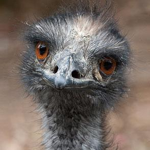
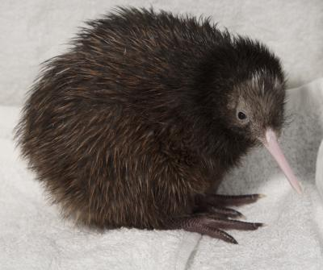

# Logistic regression

## Bird dataset

To briefly switch things up, I want to look at a new dataset giving details
of nearly 2000 bird species.

```{r}
set.seed(1)
x <- read.csv("../../data/avian_ssd_jan07.txt", as.is=TRUE, sep="\t")
x <- x[x$Clutch_size > 0,]
x <- x[x$M_mass > 0,]
x <- x[x$Egg_mass > 0,]
dim(x)
```

As a sanity check, do the birds with the largest egg mass make sense to us?

```{r}
x$English_name[order(x$Egg_mass,decreasing=TRUE)[1:10]]
```







I am interested in understanding what features make a bird have only one
egg in a clutch. We can see that the mass (male) and mass of the egg both
seem to influnce this set:

```{r}
cl <- as.numeric(x$Clutch_size == 1)
y <- cl*2 - 1
plot(x$M_mass[cl == 0], x$Egg_mass[cl == 0], log="xy",
     pch=19, cex=0.5, col=grey(0.5,0.5))
points(x$M_mass[cl == 1], x$Egg_mass[cl == 1], col="blue", pch=22)
```

We can use these two variables to fit both a linear and logistic
model for classification:

```{r}
outLm <- lm(y ~ log(M_mass) + log(Egg_mass), data=x)
summary(outLm)
outGlm <- glm(cl ~ log(M_mass) + log(Egg_mass), data=x, family="binomial")
summary(outGlm)
```

Which we can visualize as the following for the linear model:

```{r}
plot(log(x$M_mass[cl == 0]), log(x$Egg_mass[cl == 0]),
     pch=19, cex=0.5, col=grey(0.5,0.5))
points(log(x$M_mass[cl == 1]), log(x$Egg_mass[cl == 1]), col="blue", pch=22)
abline(-1 * outLm$coef[1] / outLm$coef[3], -1 * outLm$coef[2] / outLm$coef[3],
         col="#6E3179", lty="dashed", lwd=1.5)
```

But wait, this doesn't seem very helpful, right? The problem is that
the classes are unbalanced so we need to actually *move* the plane by some
amount:

```{r}
plot(log(x$M_mass[cl == 0]), log(x$Egg_mass[cl == 0]),
     pch=19, cex=0.5, col=grey(0.5,0.5))
points(log(x$M_mass[cl == 1]), log(x$Egg_mass[cl == 1]), col="blue", pch=22)
abline(-1 * outLm$coef[1] / outLm$coef[3] - 2, -1 * outLm$coef[2] / outLm$coef[3],
         col="#6E3179", lty="dashed", lwd=1.5)
```

And the GLM looks like this:

```{r}
plot(log(x$M_mass[cl == 0]), log(x$Egg_mass[cl == 0]),
     pch=19, cex=0.5, col=grey(0.5,0.5))
points(log(x$M_mass[cl == 1]), log(x$Egg_mass[cl == 1]), col="blue", pch=22)
abline(-1 * outLm$coef[1] / outLm$coef[3] - 2, -1 * outLm$coef[2] / outLm$coef[3],
         col="#000000", lty="dashed", lwd=1.5)
abline(-1 * outGlm$coef[1] / outGlm$coef[3] - 0.7, -1 * outGlm$coef[2] / outGlm$coef[3],
         col="#6E3179", lty="dashed", lwd=1.5)
```

Which both visually separate the space in a sensible way.


