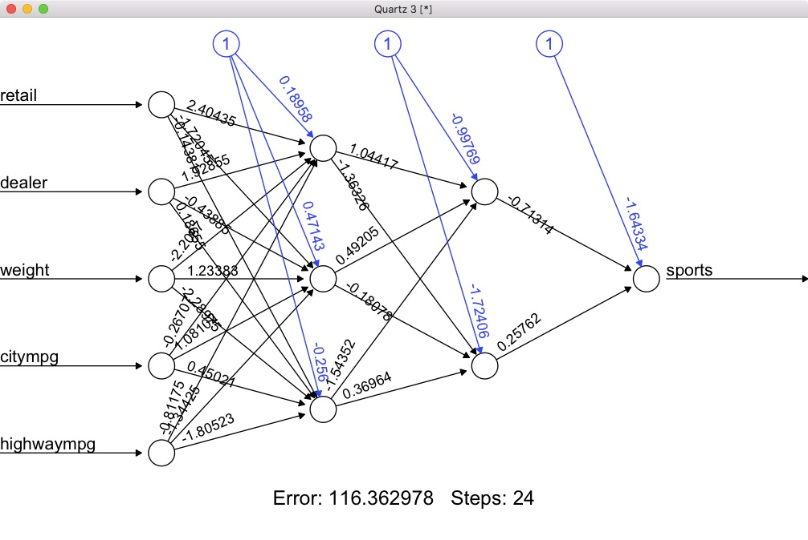

# Stochastic gradient descent

To illustrate the use of stochastic gradient descent, let us try
to use it to solve for the ordinary least squares solution in
linear regression. I will first generate a small test set of data:

```{r}
set.seed(42)
n <- 1000
p <- 10
X <- matrix(rnorm(n*p),ncol=p)
beta <- 1 / 1:p
y <- X %*% beta + rnorm(n, sd=0.5)
```

The true solution, which in this case we can calculate analytically,
is given by directly solving the normal equations. We can get these
in R by the following:

```{r}
betaOls <- coef(lm(y ~ X - 1))
```

Standard gradient descent calculates the entire gradient function and
moves some amount in the opposite direction of the gradient. Here we run this
algorithm for 2000 iterations and plot the error on the log scale:

```{r}
eta <- 0.01
b <- rep(0, p)
E <- 2000
err <- rep(NA, E)
for (k in 1:E) {
  gradFull <- (2/n) * ((t(X) %*% X) %*% b - t(X) %*% y)
  b <- b - eta * gradFull
  err[k] <- max(abs(b - betaOls))
}

plot(err, log="y", type="l", xlab="iteration")
grid()
```

Notice that the log error rate is decreasing almost exactly as a linear
function of the iteration.

I now construct a matrix of mini-batch samples. For example, with
a size of 5 I get the following:

```{r}
m <- 5
miniBatchIndex <- matrix(sample(1:n),ncol=m)
head(miniBatchIndex)
```

Using these minibatch estimates, I want to calculate an estimate of the
gradient function and again move a small direction downhill from the
current value of beta.

```{r}
eta <- 0.01
b <- rep(0, p)
err <- rep(NA, nrow(miniBatchIndex))
for (j in 1:nrow(miniBatchIndex)) {
  ind <- miniBatchIndex[j,]
  gradMini <- (2/m) * ((t(X[ind,]) %*% X[ind,]) %*% b - t(X[ind,]) %*% y[ind])
  b <- b - eta * gradMini
  err[j] <- max(abs(b - betaOls))
}

plot(err, log="y", type="l", xlab="iteration")
grid()
```

Notice that this curve is much more noisy, but gets under an error rate of 0.05
in only one pass through the data. Be careful to see that the 200 iterations here
is the equivalent of one iteration in the gradient descent approach.

Tweaking this code slightly, let's iterate over 10 epochs and see how stochastic
gradient descent converges over a longer number of cycles.

```{r}
eta <- 0.01
b <- rep(0, p)
E <- 10
err <- rep(NA, nrow(miniBatchIndex)*E)
for (k in 1:E) {
  miniBatchIndex <- matrix(sample(1:n),ncol=m)
  for (j in 1:nrow(miniBatchIndex)) {
    ind <- miniBatchIndex[j,]
    gradMini <- (1/m) * (2 * (t(X[ind,]) %*% X[ind,]) %*% b - 2 * t(X[ind,]) %*% y[ind])
    b <- b - eta * gradMini
    err[j+(k-1)*nrow(miniBatchIndex)] <- max(abs(b - betaOls))
  }
}

plot(err, log="y", type="l", axes=FALSE, xlab="epoch")
box()
axis(2)
axis(1, at=(0:E)*nrow(miniBatchIndex), 0:E)
abline(v=(1:E)*nrow(miniBatchIndex))
```

Notice that this does not actually appear to converge, but rather is essentially a
random walk after the first epoch. The issue is that we need an adaptive learning
rate. Here we divide the original learning rate by the epoch number, this causes
the movements to slow down over time.

```{r}
eta <- 0.01
b <- rep(0, p)
m <- 5
E <- 10
err <- rep(NA, nrow(miniBatchIndex)*E)
for (k in 1:E) {
  miniBatchIndex <- matrix(sample(1:n),ncol=m)
  for (j in 1:nrow(miniBatchIndex)) {
    ind <- miniBatchIndex[j,]
    gradMini <- (1/m) * (2 * (t(X[ind,]) %*% X[ind,]) %*% b - 2 * t(X[ind,]) %*% y[ind])
    b <- b - (eta) * (1 / k) * gradMini
    err[j+(k-1)*nrow(miniBatchIndex)] <- max(abs(b - betaOls))
  }
}

plot(err, log="y", type="l", axes=FALSE, xlab="epoch")
box()
axis(2)
axis(1, at=(0:E)*nrow(miniBatchIndex), 0:E)
abline(v=(1:E)*nrow(miniBatchIndex))
```

There is still a good amount of noise in the middle of the epoch (you can think of this
as a type of bias given that some data points have been used more than others), but at
the end of each epoch the value has improved compared to the value at the end of the
prior epoch. We are able to get to within 0.001 in just 10 cycles of the data, something
which would takes nearly 500 iterations in the non-stochastic variant.

# Simple neural network

Support for running modern, deep, neural networks in R is quite weak. Here I will show
how to use the two most popular packages that do exist, but after today we will use
my own code or call routines in other languages. To start, let's load in the cars
dataset:

```{r}
set.seed(1)
x <- read.csv("../../data/cars.csv", as.is=TRUE)
names(x) <- tolower(names(x))
x$expensive <- as.numeric(x$retail > median(x$retail))
x$testFlag <- as.numeric(runif(nrow(x)) > 0.8)
head(x)
```

For a point of reference, I'll fit a logistic regression on the response of whether
this care is in the upper half of the dataset in terms of retail price:

```{r}
out <- glm(expensive ~ weight + citympg + highwaympg + sports + suv,
                  data=x,
                  subset=(testFlag == 0),
                  family=binomial)
predGlm <- predict(out, x, type='response')
```

Using the **nnet** package, I can fit a neural network with one hidden layers with
10 nodes:

```{r}
library(nnet)
out <- nnet(expensive ~ weight + citympg + highwaympg + sports + suv,
                  data=x,
                  subset=(testFlag == 0),
                  size=10)
predNnet10 <- predict(out, x)
table(predNnet10)
```

Notice that the prediction results are all the same. In truth, we do not have enough
nodes here to learn anything useful. If I increase this number to 500, the results
seem to mimic those of the glm model fairly well.

```{r}
out <- nnet(expensive ~ weight + citympg + highwaympg + sports + suv,
                  data=x,
                  subset=(testFlag == 0),
                  size=500,
                  MaxNWts=7500L)
predNnet500 <- predict(out, x)
table(round(predNnet500,2))
cor(predNnet500, predGlm)
```

Increasing the number of nodes to 900, we see that the correlation actually
drops; at this point, the capacity of the model is too large given the input
data size.


```{r}
out <- nnet(expensive ~ weight + citympg + highwaympg + sports + suv,
                  data=x,
                  subset=(testFlag == 0),
                  size=900,
                  MaxNWts=7500L)
predNnet900 <- predict(out, x)
table(round(predNnet900,2))
cor(predNnet900, predGlm)
```

Testing these results, notice that the neural network with 500 nodes outperforms
the glm, but the other models under-perform.

```{r}
tapply(as.numeric(predGlm > 0.5) == x$expensive, x$testFlag, mean)
tapply(as.numeric(predNnet10 > 0.5) == x$expensive, x$testFlag, mean)
tapply(as.numeric(predNnet500 > 0.5) == x$expensive, x$testFlag, mean)
tapply(as.numeric(predNnet900 > 0.5) == x$expensive, x$testFlag, mean)
```

This is a general property of neural networks that will soon become painfully
obvious: there is some way to construct a very predictive neural network, but
unless it is very well tuned it will often get outperformed by much simpler
models.

The **nnet** package is actually quite well written, the *multinom* function is
particularly useful, but only handles a single hidden layer. The **neuralnet**
allows for larger models, but I have never had much luck with using it. I think
the only real use of it is to quickly construct a visualization of a simple neural
network model:

```{r}
library(neuralnet)
out <- neuralnet(expensive ~ weight + citympg + highwaympg + sports + suv,
                  data=x,
                  err.fct="sse",
                  hidden=c(3,2),
                  linear.output=FALSE,
                  likelihood=TRUE)
plot(out)
```




